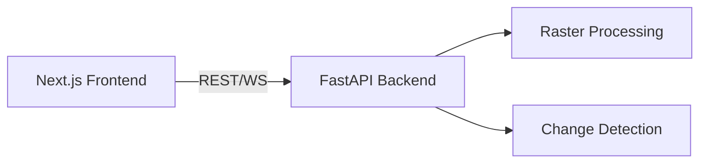

# DGIS GeoAI Platform


## 🌐 Product X (Twitter) Profile
Follow our latest updates on X: [DGIS_GeoAI](https://x.com/DGIS_GeoAI)

## 🚀 Live Preprod URL
- **Frontend**: [https://dgis-geoai-frontend.vercel.app](https://dgis-geoai-frontend.vercel.app)
- **Backend API**: [https://dgis-geoai-backend.onrender.com/health](https://dgis-geoai-backend.onrender.com/health)

*(Note: These are placeholders. Once automated deployment is fully configured via Vercel and Render, the live URLs will reflect the actual endpoints).*

## 🏗️ Features & Architecture



## 🛠️ Quickstart Guide

### Prerequisites
- Node.js 18+
- Python 3.10+

### Local Installation

**Backend**
```bash
cd backend
python -m venv venv
source venv/bin/activate  # On Windows: venv\Scripts\activate
pip install -r requirements.txt
uvicorn app.main:app --reload
```

**Frontend**
```bash
cd frontend
npm install
npm run dev
```

### Environment Variables
Configure your environment variables using `.env.example` as a reference. Ensure `ALLOWED_ORIGINS` is set properly in your backend for CORS.

## 📖 API Reference

| Endpoint | Method | Description |
|----------|--------|-------------|
| `/api/search` | GET | Vector search mechanism |
| `/api/change-detection` | GET | Raster processing and change detection |
| `/ws/scan` | WS | Real-time scan via websocket |
 
